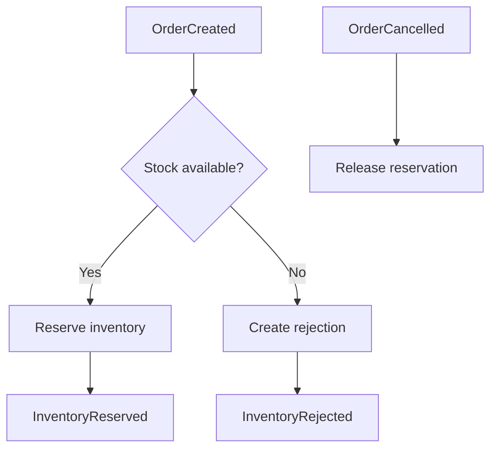

# Inventory Service

Event-driven Spring Boot microservice that reserves and releases stock in
response to order lifecycle events.

## Responsibilities

- Consume `OrderCreated` and `OrderCancelled`
- Reserve inventory using database locking
- Reject orders when products are missing or stock is insufficient
- Release reservations during cancellation compensation
- Publish `InventoryReserved` and `InventoryRejected`
- Process duplicate Kafka deliveries safely
- Route invalid messages to a dead-letter topic

## Event flow



## Topics

| Topic | Direction | Purpose |
|---|---|---|
| `order-events` | Consumed | Order creation and cancellation |
| `inventory-events` | Produced | Reservation and rejection outcomes |
| `order-events.DLT` | Produced | Permanently invalid order events |

## Data model

| Table | Purpose |
|---|---|
| `inventory_items` | Available and reserved quantities |
| `inventory_reservations` | Per-order stock reservations |
| `processed_events` | Consumer idempotency |
| `outbox_events` | Reliable outgoing event publication |

## Consistency and concurrency

All inventory changes and result events share one PostgreSQL transaction.

Inventory rows use pessimistic locks during reservation and release. Products
are locked in a stable order to reduce deadlock risk. Duplicate product entries
in an order are aggregated before stock validation.

Cancellation releases inventory exactly once. Duplicate cancellation events are
ignored through the processed-event table.

## Failure handling

- Business rejection produces `InventoryRejected`.
- Invalid payloads and unsupported event versions go to the DLT.
- Unexpected technical errors retry with fixed backoff.
- Failed reservation transactions leave no partial stock changes.
- DLT records retain the original payload and exception metadata.

## Development inventory

Flyway provides local seed products:

| Product | Initial quantity |
|---|---:|
| `product-001` | 100 |
| `product-002` | 50 |
| `product-003` | 25 |

## Run locally

Requirements:

- Java 21
- Docker Desktop
- Kafka available at `localhost:9092`

Start PostgreSQL:

```powershell
docker compose up -d postgres
```

Run tests:

```powershell
.\mvnw.cmd clean test
```

Start the service:

```powershell
.\mvnw.cmd spring-boot:run
```

The service uses port `8081`.

For the complete environment, use the sibling `commerce-platform` repository.